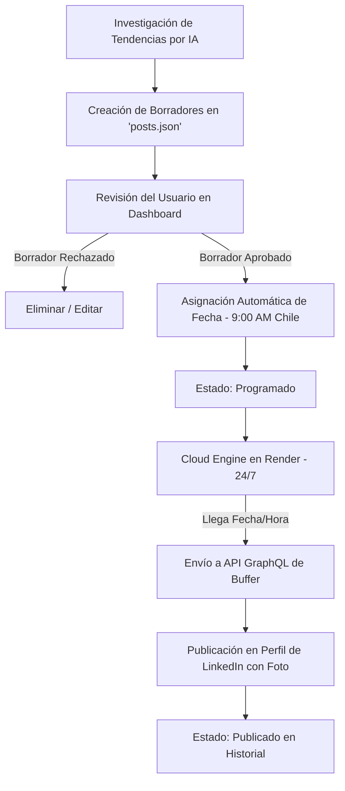

# 🚀 Documentación del Proyecto: nicoinnova LinkedIn Manager

Este documento detalla la arquitectura, el flujo de trabajo, las integraciones y las instrucciones completas de uso del gestor automático de publicaciones para LinkedIn de **nicoinnova**.

---

## 📌 1. Visión General y Arquitectura

El sistema es una plataforma web moderna diseñada para la automatización, curación y programación de publicaciones para LinkedIn en español.

### Componentes Clave:
1. **Servidor Backend Node.js / Express**:
   * Alojado 24/7 en los servidores en la nube de **Render** (`https://linkedin-nico.onrender.com`).
   * Ejecuta una tarea en segundo plano que revisa la cola de publicaciones cada 60 segundos.
2. **Motor de Publicación Transparente (Buffer GraphQL API)**:
   * Conectado al canal oficial de LinkedIn **`nicolaspeñadiaz`** vía Buffer API.
   * Publica en tiempo real texto enriquecido e imágenes adjuntas (`ImageAssetInput`).
3. **Agente de Curación e Inteligencia Artificial (Antigravity AI)**:
   * Monitorea **Google Trends, Reddit, X (Twitter) y creadores líderes** de tecnología y startups.
   * Redacta publicaciones en español natural sin palabras cliché ni menciones a marcas corporativas.
4. **Base de Datos Persistente (`posts.json`)**:
   * Mantiene el estado de todas las publicaciones (`draft`, `scheduled`, `published`).

---

## ⏰ 2. Reglas de Publicación y Horarios

* **Días Habilitados**: **Lunes, Martes, Miércoles, Jueves y Viernes** (Días laborales).
* **Hora Exacta de Publicación**: **9:00 AM (Hora de Chile - CLT / UTC-4)** *(13:00 UTC en servidores cloud)*.
* **Algoritmo de Espacios Libres**: Al aprobar un borrador, la app busca automáticamente el siguiente día laboral disponible a las 9:00 AM Chile que no esté ocupado por otra publicación ni listado en días bloqueados.

---

## 🔄 3. Flujo de Trabajo Completo (Workflow)



### Detalle de Pasos:
1. **Generación**: La IA investiga temas de tendencia (agentes de IA, arquitectura no-code, desarrollo modular, productividad) y genera borradores.
2. **Aprobación**: Entras a `https://linkedin-nico.onrender.com`, vas a **Borradores** y haces clic en el botón de check **`✔`** (Aprobar).
3. **Programación**: El post pasa inmediatamente a **Programado** y se le asigna el siguiente slot libre (ej. Lunes a Viernes a las 9:00 AM).
4. **Publicación Automática**: El motor en Render envía la solicitud a Buffer a la hora exacta **sin necesidad de que tu computador esté encendido**.
5. **Historial**: El post se mueve a la sección **Historial de Publicaciones Realizadas** en la pestaña **Calendario**.

---

## 📖 4. Guía de Uso del Dashboard

### Acceso a la Plataforma:
👉 **[https://linkedin-nico.onrender.com](https://linkedin-nico.onrender.com)**

### Pestañas del Panel:

#### 1. Panel General (Resumen)
* **Bandeja de Borradores**: Vista previa rápida de los borradores sugeridos por la IA.
* **Píldora de Estado**: Muestra `🟢 Buffer Conectado (LinkedIn)` confirmando que el motor en la nube está activo.

#### 2. Borradores
* **Visualizar y Editar**: Haz clic en el ícono de lápiz `✏️` para ajustar el título, contenido o la URL de la imagen.
* **Aprobar**: Haz clic en el botón verde `✔` para agendar la publicación automáticamente a las 9:00 AM Chile.

#### 3. Calendario
* **Sección 1: Próximas Publicaciones Programadas (Azul)**:
  * Lista cronológica de todas las publicaciones que saldrán en los próximos días.
  * Botón **`⚡ Publicar API`**: Te permite forzar la salida del post en vivo al instante si no quieres esperar a la fecha programada.
  * Botón **`🚀 Copiar`**: Copia el texto y abre el cuadro de compartir en LinkedIn en 1 clic.
* **Sección 2: Historial de Publicaciones Realizadas (Verde)**:
  * Registro de todos los posts que ya fueron enviados exitosamente a tu muro de LinkedIn.

---

## ⚙️ 5. Estructura de Archivos del Proyecto

```text
nicoinnova linkedin/
├── server.js               # Servidor Node.js, endpoints REST y Cloud Engine de publicación 24/7
├── posts.json              # Base de datos JSON de publicaciones (drafts, scheduled, published)
├── config.json             # Configuración del sistema y bloqueos
├── DOCUMENTACION.md        # Documentación técnica y manual de uso
├── public/
│   ├── index.html          # Interfaz de usuario SPA con Tailwind/Vanilla CSS
│   ├── app.js              # Lógica de renderizado dinámico e interacción del cliente
│   └── styles.css          # Estilos y tema oscuro moderno
└── package.json            # Dependencias del proyecto (express, dotenv, etc.)
```

---

## 🛡️ 6. Mantenimiento y Respaldos

* **Repositorio de Código**: Sincronizado en GitHub en `nicolass309/linkedin-nico`.
* **Despliegue Automático**: Cada cambio en la rama `main` despliega automáticamente una versión limpia en Render.
