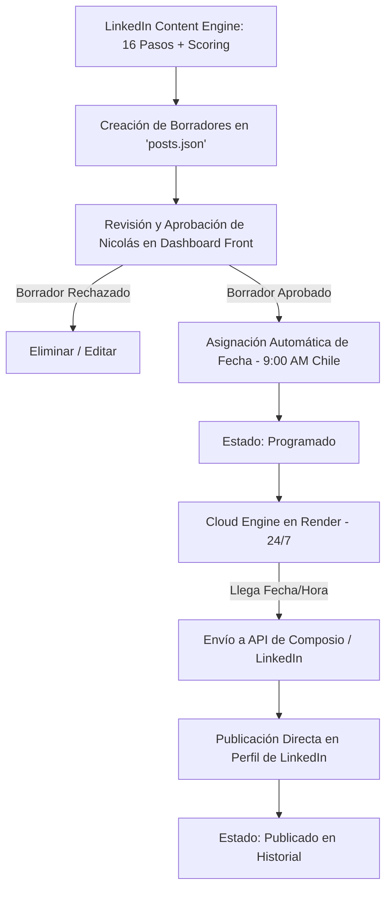

# 🚀 Documentación del Proyecto: nicoinnova LinkedIn Manager

Este documento detalla la arquitectura, el flujo de trabajo, las integraciones y las instrucciones completas de uso del gestor automático de publicaciones para LinkedIn de **nicoinnova**.

---

## 📌 1. Visión General y Arquitectura

El sistema es una plataforma web moderna diseñada para la automatización, curación y programación de publicaciones para LinkedIn en español.

### Componentes Clave:
1. **Servidor Backend Node.js / Express**:
   * Alojado 24/7 en los servidores en la nube de **Render** (`https://linkedin-nico.onrender.com`).
   * Ejecuta una tarea en segundo plano que revisa la cola de publicaciones cada 60 segundos.
2. **Motor de Publicación Directo (Composio LinkedIn API)**:
   * Conectado al canal oficial de LinkedIn **`nicolaspeñadiaz`** (`urn:li:person:-4DFGTk-xF`) vía Composio MCP.
   * Publica de forma transparente y sin límites de cuota reducidos de terceros.
3. **Agente de Curación e Inteligencia Artificial (LinkedIn Content Engine)**:
   * Opera bajo la skill `linkedin-content-engine` con un pipeline de 16 pasos y 8 arquetipos narrativos.
   * Monitorea avances de frontera (OpenAI, Anthropic, Google, MCP, Y Combinator, startups Latam).
   * Redacta con filtros estrictos anti-AI-slop, scoring previo mínimo de 85/100 y curaduría fotográfica en Pexels y Unsplash.
4. **Base de Datos Persistente (`posts.json`)**:
   * Mantiene el estado de todas las publicaciones (`draft`, `scheduled`, `published`).

---

## ⏰ 2. Reglas de Publicación y Horarios

* **Días Habilitados**: **Lunes, Martes, Miércoles, Jueves y Viernes** (Días laborales).
* **Hora Exacta de Publicación**: **9:00 AM (Hora de Chile - CLT / UTC-4)** *(13:00 UTC en servidores cloud)*.
* **Algoritmo de Espacios Libres**: Al aprobar un borrador, la app busca automáticamente el siguiente día laboral disponible a las 9:00 AM Chile que no esté ocupado por otra publicación ni listado en días bloqueados.

---

## 🔄 3. Flujo de Trabajo Completo (Workflow Inmutable)


```mermaid
graph TD
    A[LinkedIn Content Engine: 16 Pasos + Scoring] --> B[Creación de Borradores en 'posts.json']
    B --> C[Revisión y Aprobación de Nicolás en Dashboard Front]
    C -->|Borrador Rechazado| D[Eliminar / Editar]
    C -->|Borrador Aprobado| E[Asignación Automática de Fecha - 9:00 AM Chile]
    E --> F[Estado: Programado]
    F --> G[Cloud Engine en Render - 24/7]
    G -->|Llega Fecha/Hora| H[Envío a API de Composio / LinkedIn]
    H --> I[Publicación Directa en Perfil de LinkedIn]
    I --> J[Estado: Publicado en Historial]
```

### Detalle del Flujo de 4 Fases:
1. **Fase 1 - Generación Inteligente**: La IA aplica los 16 pasos del `linkedin-content-engine` (investigación de frontera, anclaje de entidades, arquetipo narrativo, filtro anti-slop y scoring > 85/100) y registra el post como `draft` en `posts.json`.
2. **Fase 2 - Subida al Front**: El borrador queda visible al instante en el dashboard web (`https://linkedin-nico.onrender.com/`).
3. **Fase 3 - Revisión y Aprobación Humana**: Entras a **Borradores**, ajustas lo que consideres conveniente y haces clic en el botón de check **`✔`** (Aprobar). Si no te convence, lo editas con el lápiz o lo eliminas.
4. **Fase 4 - Publicación Automática**: El motor en la nube de Render toma el post aprobado, le asigna el próximo horario libre a las 9:00 AM y lo publica vía Composio sin requerir tu intervención.

---

## 📖 4. Guía de Uso del Dashboard

### Acceso a la Plataforma:
👉 **[https://linkedin-nico.onrender.com](https://linkedin-nico.onrender.com)**

### Pestañas del Panel:

#### 1. Panel General (Resumen)
* **Bandeja de Borradores**: Vista previa rápida de los borradores sugeridos por la IA.
* **Píldora de Estado**: Muestra `🟢 Composio Conectado (LinkedIn API)` confirmando que el motor en la nube está activo.

#### 2. Borradores
* **Visualizar y Editar**: Haz clic en el ícono de lápiz `✏️` para ajustar el título, contenido o la URL de la imagen.
* **Aprobar**: Haz clic en el botón verde `✔` para agendar la publicación automáticamente a las 9:00 AM Chile.

#### 3. Calendario
* **Sección 1: Próximas Publicaciones Programadas (Azul)**:
  * Lista cronológica de todas las publicaciones que saldrán en los próximos días.
  * Botón **`⚡ Publicar API`**: Te permite forzar la salida del post en vivo al instante si no quieres esperar a la fecha programada.
  * Botón **`🚀 Copiar`**: Copia el texto y abre el cuadro de compartir en LinkedIn en 1 clic.
* **Sección 2: Historial de Publicaciones Realizadas (Verde)**:
  * Registro de todos los posts que ya fueron enviados exitosamente a tu muro de LinkedIn.

---

## ⚙️ 5. Estructura de Archivos del Proyecto

```text
nicoinnova linkedin/
├── server.js               # Servidor Node.js, endpoints REST y Cloud Engine de publicación 24/7
├── posts.json              # Base de datos JSON de publicaciones (drafts, scheduled, published)
├── config.json             # Configuración del sistema y bloqueos
├── DOCUMENTACION.md        # Documentación técnica y manual de uso
├── public/
│   ├── index.html          # Interfaz de usuario SPA con Tailwind/Vanilla CSS
│   ├── app.js              # Lógica de renderizado dinámico e interacción del cliente
│   └── styles.css          # Estilos y tema oscuro moderno
└── package.json            # Dependencias del proyecto (express, dotenv, etc.)
```

---

## 🛡️ 6. Mantenimiento y Respaldos

* **Repositorio de Código**: Sincronizado en GitHub en `nicolass309/linkedin-nico`.
* **Despliegue Automático**: Cada cambio en la rama `main` despliega automáticamente una versión limpia en Render.
